# 🏗️ Data Architecture: Layered Storage для Product Metrics

> Как хранить и агрегировать данные для эффективного расчёта метрик

---

## 📑 Содержание

1. [Overview: 4-Layer Architecture](#overview-4-layer-architecture)
2. [Layer 1: Raw Events](#layer-1-raw-events-90-дней)
3. [Layer 2: Daily Aggregates](#layer-2-daily-aggregates-2-года)
4. [Layer 2.5: Weekly Aggregates](#layer-25-weekly-aggregates-1-год)
5. [Layer 3: Monthly Aggregates](#layer-3-monthly-aggregates-∞)
6. [Special Tables: Cohorts](#special-tables-cohort-snapshots)
7. [ETL Pipeline](#etl-pipeline)
8. [Retention Policies](#retention-policies)
9. [Metrics: Source Mapping](#metrics-source-mapping)
10. [Query Examples](#query-examples)

---

## OVERVIEW: 4-Layer Architecture

### Концепция

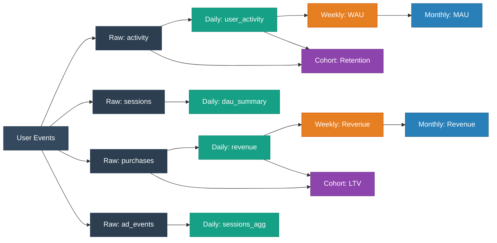

---

## LAYER 1: RAW EVENTS (90 дней)

### Характеристики

| Параметр | Значение |
|----------|----------|
| **Retention** | 90 дней |
| **Size** | ~10 TB (зависит от MAU) |
| **Cost** | ~$2,000/месяц |
| **Update** | Real-time (streaming) |
| **Используется для** | Детальный анализ, A/B тесты, Debug, Ad-hoc запросы |
| **Queries** | Медленные (большие объёмы) |

### Таблицы

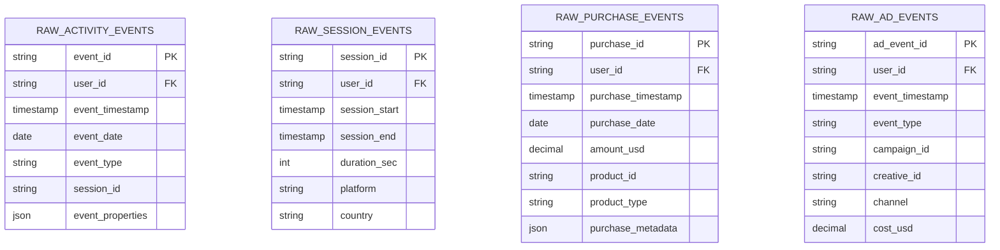

---

## LAYER 2: DAILY AGGREGATES (2 года)

### Характеристики

| Параметр | Значение |
|----------|----------|
| **Retention** | 730 дней (2 года) |
| **Size** | ~500 GB |
| **Cost** | ~$100/месяц |
| **Update** | Daily ETL (каждую ночь) |
| **Используется для** | Дашборды, Retention D180/D365, LTV расчёты, Когортный анализ |
| **Queries** | Быстрые (pre-aggregated) |

### Data Flow

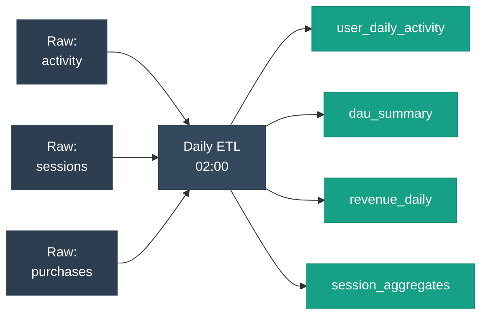

### Таблицы Layer 2

**Retention:** 730 дней | **Size:** ~500 GB | **Update:** Daily ETL

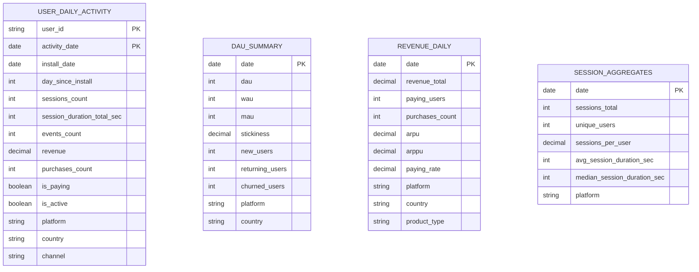

### 📍 Важно: Оптимальная стратегия хранения

#### Подход: Только АКТИВНЫЕ пользователи + Churn Tracker

**user_daily_activity хранит ТОЛЬКО активных пользователей в каждый день:**

```sql
-- ETL: Добавляем только тех, кто был активен вчера
INSERT INTO user_daily_activity
SELECT user_id, yesterday, ...
FROM raw_activity_events
WHERE event_date = yesterday  -- Только активные!
GROUP BY user_id;
```

**Преимущества:**
- 💾 Экономия 95% места (300 GB vs 6 TB)
- ⚡ Запросы в 10+ раз быстрее
- 💰 Стоимость в 30+ раз ниже

**Для churn detection добавляем отдельную таблицу:**

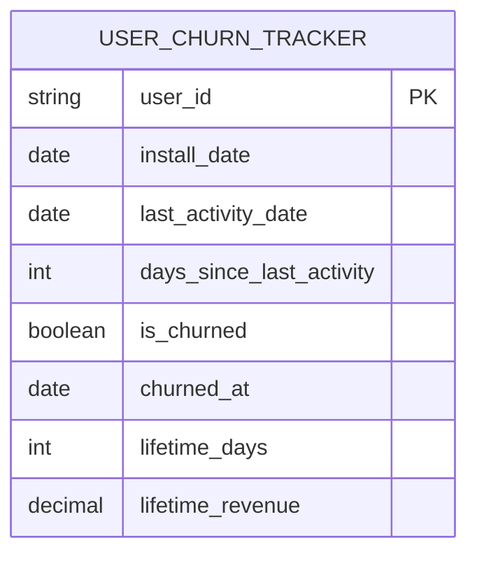

**Характеристики USER_CHURN_TRACKER:**
- 📊 **1 запись = 1 user** (всегда)
- 🔄 **UPDATE** каждый день (перезапись)
- 💾 **Константный размер** (~5 GB для 10M users)
- ⚡ **Быстрый доступ** к churn status

**ETL процесс:**

```python
def daily_etl():
    # 1. INSERT только активных → user_daily_activity
    for active_user in get_active_users(yesterday):
        insert_into_user_daily_activity(active_user)
    
    # 2. UPDATE всех users → user_churn_tracker
    # Активные: обнуляем days_inactive
    update_active_users_churn_tracker(yesterday)
    
    # Неактивные: увеличиваем days_inactive
    increment_inactive_users_counter()
```

**Размер данных (пример: 1M MAU):**

| Таблица | Записей | Размер | Retention |
|---------|---------|--------|-----------|
| user_daily_activity | 300K/day × 730 = 219M | 300 GB | 730 дней |
| user_churn_tracker | 10M (фиксированно) | 5 GB | Forever |
| **Total** | - | **305 GB** | - |

vs. альтернатива (все users каждый день): **6 TB** ❌

---

## LAYER 2.5: WEEKLY AGGREGATES (1 год)

### Характеристики

| Параметр | Значение |
|----------|----------|
| **Retention** | 365 дней (1 год) |
| **Size** | ~50 GB |
| **Cost** | ~$10/месяц |
| **Update** | Weekly ETL (каждый понедельник) |
| **Используется для** | Weekly reports, WAU trends, Week-over-Week analysis, Marketing reports |
| **Queries** | Быстрые (pre-aggregated) |

### Data Flow

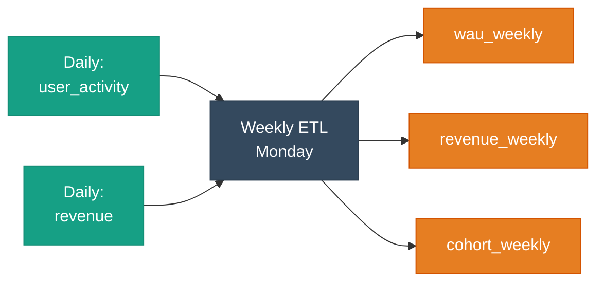

### Таблицы Layer 2.5

**Retention:** 365 дней | **Size:** ~50 GB | **Update:** Weekly ETL

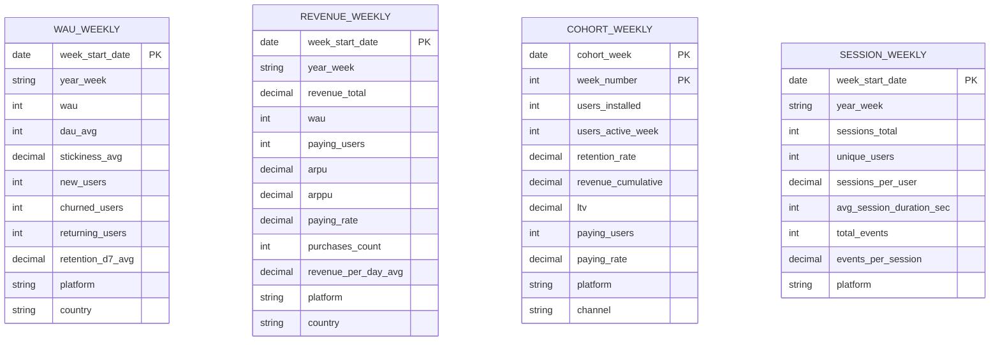

---

## LAYER 3: MONTHLY AGGREGATES (∞)

### Характеристики

| Параметр | Значение |
|----------|----------|
| **Retention** | ∞ (forever) |
| **Size** | ~10 GB |
| **Cost** | ~$2/месяц |
| **Update** | Monthly ETL (1-го числа каждого месяца) |
| **Используется для** | Executive reports, Forecasting, YoY analysis, Board meetings |
| **Queries** | Очень быстрые (мало данных) |

### Data Flow

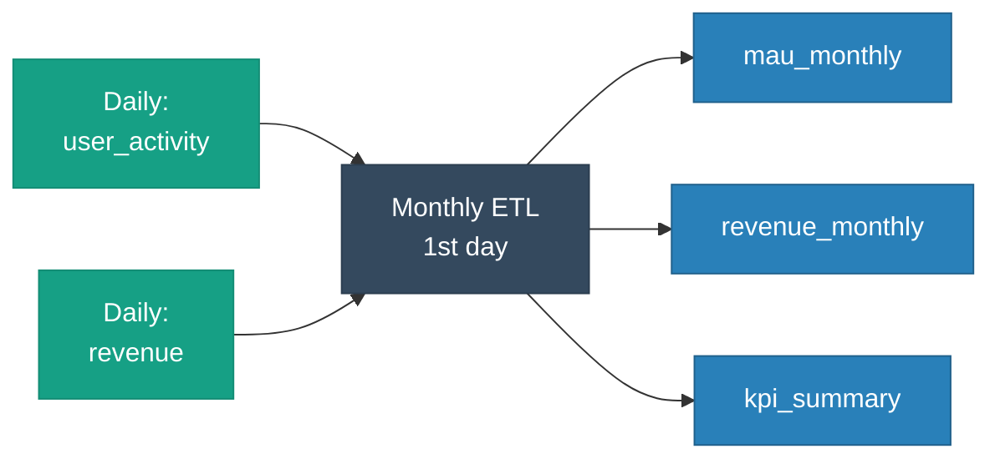

### Таблицы Layer 3

**Retention:** Forever | **Size:** ~10 GB | **Update:** Monthly ETL

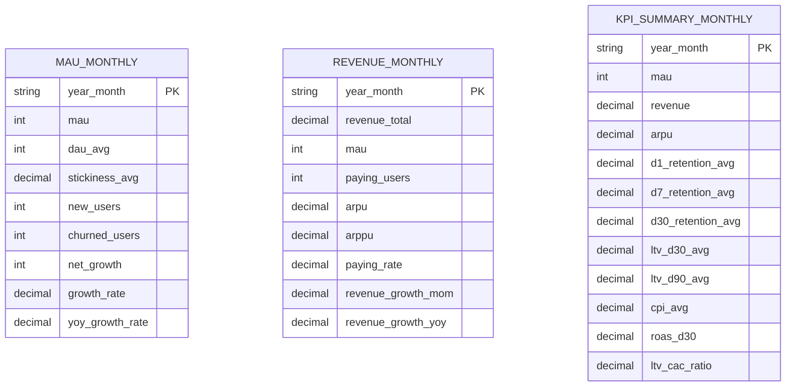

---

## SPECIAL TABLES: COHORT SNAPSHOTS

### Характеристики

| Параметр | Значение |
|----------|----------|
| **Retention** | ∞ (forever) |
| **Size** | ~50 GB |
| **Update** | Daily (для активных когорт) |
| **Используется для** | Retention curves, LTV curves, Cohort analysis |

### Концепция

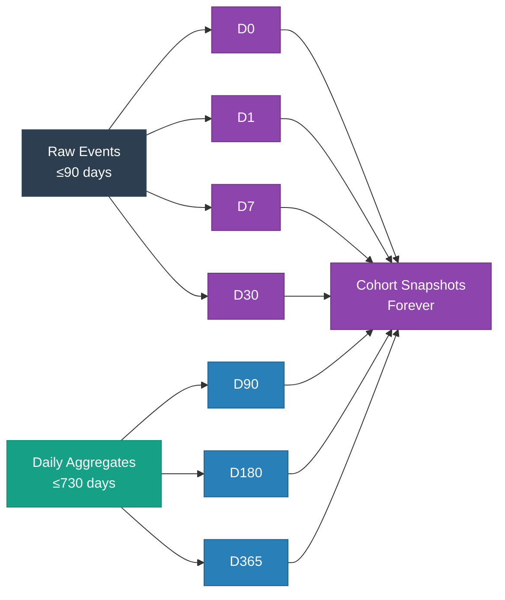

### Таблицы Special

**Retention:** Forever | **Size:** ~50 GB | **Update:** Daily

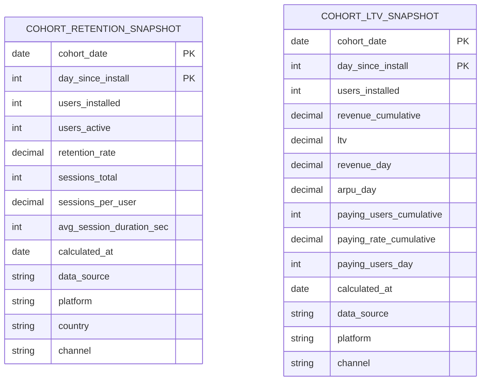

---

## ETL PIPELINE

### Daily Job (02:00 каждую ночь)

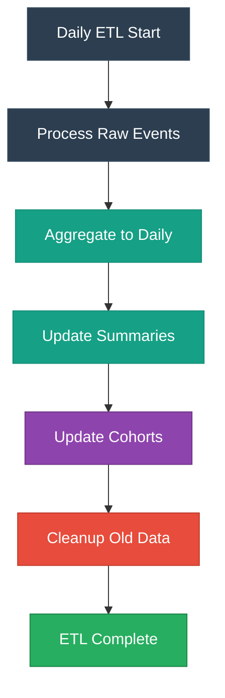

### Weekly Job (каждый понедельник)

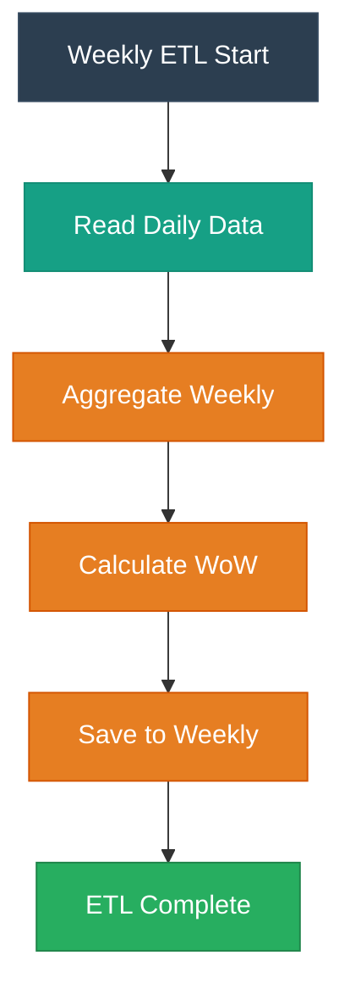

### Monthly Job (1-го числа месяца)

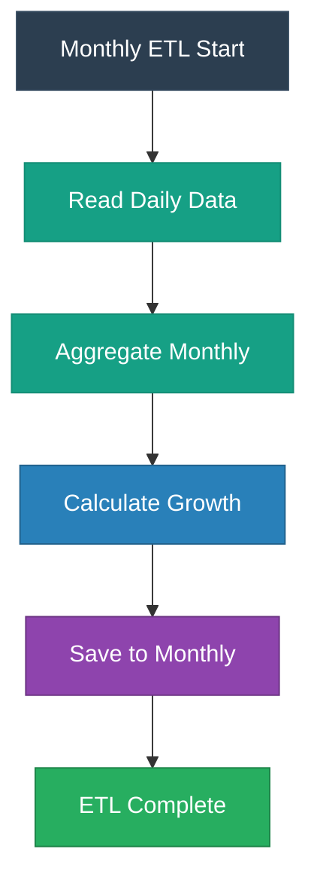

---

## RETENTION POLICIES

### Таблица политик

| Layer | Таблица | Retention | Auto-Delete | Size | Cost/мес |
|-------|---------|-----------|-------------|------|----------|
| **Layer 1** | `raw_activity_events` | 90 дней | ✅ | 5 TB | $1,000 |
| **Layer 1** | `raw_session_events` | 90 дней | ✅ | 3 TB | $600 |
| **Layer 1** | `raw_purchase_events` | 90 дней | ✅ | 1 TB | $200 |
| **Layer 1** | `raw_ad_events` | 90 дней | ✅ | 1 TB | $200 |
| | | | | | |
| **Layer 2** | `user_daily_activity` | 730 дней | ✅ | 300 GB | $60 |
| **Layer 2** | `user_churn_tracker` | Forever | ❌ | 5 GB | $1 |
| **Layer 2** | `dau_summary` | 730 дней | ✅ | 100 GB | $20 |
| **Layer 2** | `revenue_daily` | 730 дней | ✅ | 50 GB | $10 |
| **Layer 2** | `session_aggregates` | 730 дней | ✅ | 50 GB | $10 |
| | | | | | |
| **Layer 2.5** | `wau_weekly` | 365 дней | ✅ | 20 GB | $4 |
| **Layer 2.5** | `revenue_weekly` | 365 дней | ✅ | 15 GB | $3 |
| **Layer 2.5** | `cohort_weekly` | 365 дней | ✅ | 10 GB | $2 |
| **Layer 2.5** | `session_weekly` | 365 дней | ✅ | 5 GB | $1 |
| | | | | | |
| **Layer 3** | `mau_monthly` | Forever | ❌ | 5 GB | $1 |
| **Layer 3** | `revenue_monthly` | Forever | ❌ | 3 GB | $0.5 |
| **Layer 3** | `kpi_summary_monthly` | Forever | ❌ | 2 GB | $0.5 |
| | | | | | |
| **Special** | `cohort_retention_snapshot` | Forever | ❌ | 30 GB | $6 |
| **Special** | `cohort_ltv_snapshot` | Forever | ❌ | 20 GB | $4 |

**Итого:**
- **Layer 1 (Raw):** $2,000/мес
- **Layer 2 (Daily):** $101/мес (включая churn_tracker)
- **Layer 2.5 (Weekly):** $10/мес
- **Layer 3 (Monthly):** $2/мес
- **Special (Cohorts):** $10/мес

**Total: $2,123/мес**

**vs. Альтернативы:**
- Хранить все raw forever: $20,000+/мес ❌
- Хранить все users в daily: $6,500/мес ❌
- Оптимальная архитектура: **$2,123/мес** ✅

---

## METRICS: SOURCE MAPPING

### Откуда берутся метрики?

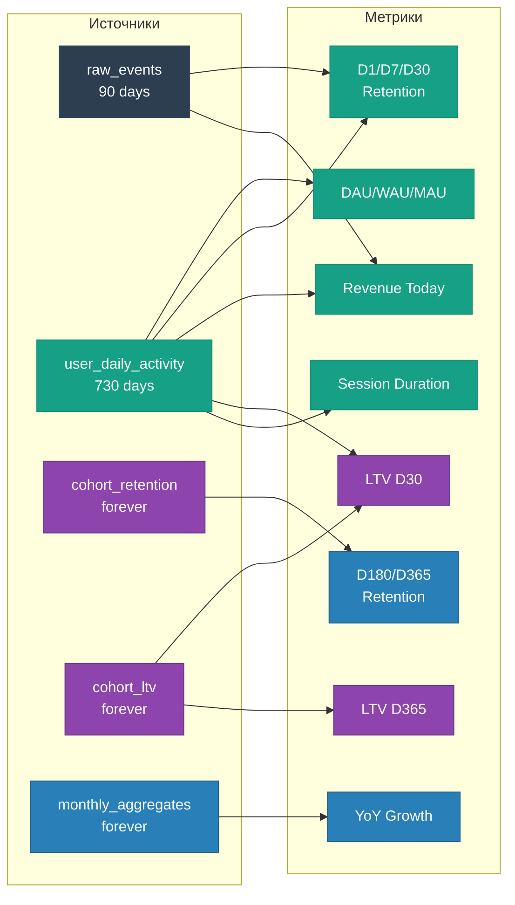

### Детальная таблица

| Метрика | Timeframe | Source Layer | Source Table | Comment |
|---------|-----------|--------------|--------------|---------|
| **DAU** | Today | Layer 1 | `raw_activity_events` | Real-time |
| **DAU** | Last 90 days | Layer 1 | `raw_activity_events` | Fast |
| **DAU** | 90+ days ago | Layer 2 | `dau_summary` | Pre-calculated |
| | | | | |
| **D1 Retention** | Fresh cohorts (≤90d) | Layer 1 | `raw_activity_events` | Can calculate from raw |
| **D1 Retention** | Old cohorts (>90d) | Special | `cohort_retention_snapshot` | Raw deleted, use snapshot |
| | | | | |
| **D7 Retention** | Fresh cohorts (≤90d) | Layer 1 | `raw_activity_events` | Can calculate from raw |
| **D7 Retention** | Old cohorts (>90d) | Special | `cohort_retention_snapshot` | Use snapshot |
| | | | | |
| **D30 Retention** | Fresh cohorts (≤90d) | Layer 1 + Layer 2 | `raw_activity_events` + `user_daily_activity` | Mix sources |
| **D30 Retention** | Old cohorts (>90d) | Special | `cohort_retention_snapshot` | Use snapshot |
| | | | | |
| **D90 Retention** | Fresh cohorts (≤90d) | Layer 2 | `user_daily_activity` | Raw already deleted for D90 |
| **D90 Retention** | Old cohorts (>90d) | Special | `cohort_retention_snapshot` | Use snapshot |
| | | | | |
| **D180 Retention** | Any cohort | Special | `cohort_retention_snapshot` | Always from snapshot |
| **D365 Retention** | Any cohort | Special | `cohort_retention_snapshot` | Always from snapshot |
| | | | | |
| **Revenue Today** | Today | Layer 1 | `raw_purchase_events` | Real-time |
| **Revenue Last 90d** | Last 90 days | Layer 1 | `raw_purchase_events` | From raw |
| **Revenue 90+ days** | 90+ days ago | Layer 2 | `revenue_daily` | Pre-calculated |
| | | | | |
| **LTV D30** | Fresh cohorts | Layer 1 + Layer 2 | Mix | Can calculate |
| **LTV D30** | Old cohorts | Special | `cohort_ltv_snapshot` | Use snapshot |
| | | | | |
| **LTV D90** | Any cohort | Special | `cohort_ltv_snapshot` | Always from snapshot |
| **LTV D180** | Any cohort | Special | `cohort_ltv_snapshot` | Always from snapshot |
| **LTV D365** | Any cohort | Special | `cohort_ltv_snapshot` | Always from snapshot |
| | | | | |
| **ARPU** | Last 90 days | Layer 1 | `raw_purchase_events` + `raw_activity_events` | From raw |
| **ARPU** | 90+ days | Layer 2 | `revenue_daily` + `dau_summary` | Pre-calculated |
| | | | | |
| **MAU** | Current month | Layer 2 | `user_daily_activity` | Rolling 30 days |
| **MAU** | Previous months | Layer 3 | `mau_monthly` | Pre-calculated |
| | | | | |
| **YoY Growth** | Any period | Layer 3 | `monthly_aggregates` | Pre-calculated |

---

## QUERY EXAMPLES

### 1. DAU за последние 30 дней

```sql
-- ✅ БЫСТРО: используем raw events (последние 90 дней)
SELECT 
    event_date,
    COUNT(DISTINCT user_id) as dau
FROM raw_activity_events
WHERE event_date >= CURRENT_DATE - INTERVAL '30 days'
GROUP BY event_date
ORDER BY event_date;
```

---

### 2. DAU за прошлый год

```sql
-- ✅ БЫСТРО: используем pre-calculated summary
SELECT 
    date,
    dau
FROM dau_summary
WHERE date >= CURRENT_DATE - INTERVAL '365 days'
  AND platform = 'ALL'
ORDER BY date;
```

---

### 3. D1 Retention для когорты 30 дней назад

```sql
-- ✅ Можем использовать raw events (≤90 дней)
WITH cohort AS (
    SELECT user_id, install_date
    FROM users
    WHERE install_date = CURRENT_DATE - INTERVAL '30 days'
),
returned_d1 AS (
    SELECT DISTINCT c.user_id
    FROM cohort c
    JOIN raw_activity_events e 
        ON c.user_id = e.user_id
        AND e.event_date = c.install_date + INTERVAL '1 day'
)
SELECT 
    COUNT(DISTINCT c.user_id) as cohort_size,
    COUNT(DISTINCT r.user_id) as returned_d1,
    COUNT(DISTINCT r.user_id) * 100.0 / COUNT(DISTINCT c.user_id) as d1_retention
FROM cohort c
LEFT JOIN returned_d1 r ON c.user_id = r.user_id;
```

---

### 4. D1 Retention для когорты 200 дней назад

```sql
-- ❌ НЕ РАБОТАЕТ: raw events удалены (>90 дней)
-- ✅ РАБОТАЕТ: используем snapshot
SELECT 
    cohort_date,
    users_installed,
    users_active,
    retention_rate as d1_retention
FROM cohort_retention_snapshot
WHERE cohort_date = CURRENT_DATE - INTERVAL '200 days'
  AND day_since_install = 1
  AND platform = 'ALL';
```

---

### 5. D365 Retention для любой когорты

```sql
-- ✅ Всегда используем snapshot (raw не подходит)
SELECT 
    cohort_date,
    users_installed,
    users_active,
    retention_rate as d365_retention
FROM cohort_retention_snapshot
WHERE cohort_date = '2024-01-01'
  AND day_since_install = 365;
```

---

### 6. LTV D90 для когорты

```sql
-- ✅ Используем LTV snapshot
SELECT 
    cohort_date,
    users_installed,
    revenue_cumulative,
    ltv,
    paying_users_cumulative,
    paying_rate_cumulative
FROM cohort_ltv_snapshot
WHERE cohort_date = '2024-01-01'
  AND day_since_install = 90;
```

---

### 7. Retention Curve (D0-D365)

```sql
-- ✅ Быстрый запрос из snapshot
SELECT 
    day_since_install,
    retention_rate
FROM cohort_retention_snapshot
WHERE cohort_date = '2024-01-01'
  AND platform = 'ALL'
  AND day_since_install IN (0, 1, 7, 14, 30, 60, 90, 180, 365)
ORDER BY day_since_install;
```

**Результат:**

| day | retention_rate |
|-----|----------------|
| 0 | 100.0% |
| 1 | 40.0% |
| 7 | 20.0% |
| 14 | 15.0% |
| 30 | 10.0% |
| 60 | 7.0% |
| 90 | 5.0% |
| 180 | 3.0% |
| 365 | 2.0% |

---

### 8. LTV Curve (D0-D365)

```sql
-- ✅ Быстрый запрос из snapshot
SELECT 
    day_since_install,
    ltv,
    paying_rate_cumulative
FROM cohort_ltv_snapshot
WHERE cohort_date = '2024-01-01'
  AND platform = 'ALL'
ORDER BY day_since_install;
```

**Результат:**

| day | ltv | paying_rate |
|-----|-----|-------------|
| 0 | $0.00 | 0.0% |
| 1 | $0.50 | 3.0% |
| 7 | $1.50 | 4.5% |
| 30 | $5.00 | 6.0% |
| 90 | $10.00 | 7.0% |
| 180 | $13.00 | 7.5% |
| 365 | $15.00 | 8.0% |

---

### 9. MAU по месяцам (за 2 года)

```sql
-- ✅ Используем monthly aggregates
SELECT 
    year_month,
    mau,
    growth_rate as mom_growth,
    yoy_growth_rate
FROM mau_monthly
WHERE year_month >= '2023-01'
ORDER BY year_month;
```

---

### 10. YoY Revenue Growth

```sql
-- ✅ Используем monthly aggregates
SELECT 
    year_month,
    revenue_total,
    revenue_growth_yoy
FROM revenue_monthly
WHERE year_month >= '2023-01'
ORDER BY year_month;
```

---

## DECISION TREE: Какой слой использовать?

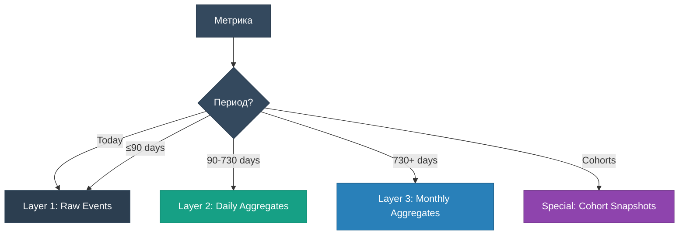

---

## KEY TAKEAWAYS

### ✅ Что нужно делать:

| Действие | Зачем |
|----------|-------|
| **Создать 4-layer архитектуру** | Разделение по retention и стоимости |
| **ETL каждый день в 02:00** | Обновление daily aggregates и cohorts |
| **Хранить только АКТИВНЫХ users** | user_daily_activity: экономия 95% места |
| **Использовать churn_tracker** | 1 запись на user, UPDATE вместо INSERT |
| **Snapshot когорт на милестоунах** | D1, D7, D30, D90, D180, D365 |
| **Partitioning по датам** | Быстрое удаление старых данных |
| **Хранить raw ≤90 дней** | Баланс между детализацией и стоимостью |
| **Хранить daily aggregates 2 года** | Для LTV D365 расчётов |
| **Хранить weekly aggregates 1 год** | Для WoW анализа |
| **Хранить monthly aggregates forever** | Для YoY анализа |
| **Cohort snapshots forever** | Для retention/LTV curves |

### ❌ Чего НЕ делать:

| Действие | Почему плохо |
|----------|--------------|
| **Хранить raw events forever** | $$$$ слишком дорого |
| **Хранить ВСЕ users в daily** | 6 TB вместо 300 GB - дорого и медленно |
| **Пересчитывать cohorts каждый раз** | Медленно, можно использовать snapshot |
| **Не делать pre-aggregation** | Запросы будут слишком долгими |
| **Удалять aggregates раньше времени** | Потеряете возможность считать D365 метрики |
| **Хранить только aggregates** | Потеряете гибкость для ad-hoc анализа |
| **Множественные записи для churn** | Используйте 1 запись + UPDATE |

---

## COST OPTIMIZATION

### До оптимизации (всё raw forever):

```
Raw events (10 TB × 12 months) = 120 TB
Cost: 120 TB × $23/TB/month = $2,760/month
Yearly: $33,120
```

### После оптимизации (3-layer):

```
Layer 1 (Raw, 90 days):      10 TB × $23/TB = $230/month
Layer 2 (Daily, 730 days):   0.5 TB × $20/TB = $10/month
Layer 3 (Monthly, forever):  0.01 TB × $10/TB = $0.10/month
Special (Cohorts, forever):  0.05 TB × $10/TB = $0.50/month

Total: $240.60/month
Yearly: $2,887
```

**Экономия: $30,233/год (91% reduction!)** 💰

---

## 📖 Связанные документы

| Документ | Описание |
|----------|----------|
| [README.md](./README.md) | Основной справочник по метрикам |
| [01_retention_metrics.ipynb](./01_retention_metrics.ipynb) | Retention analysis |
| [02_engagement_metrics.ipynb](./02_engagement_metrics.ipynb) | Engagement analysis |
| [03_monetization_metrics.ipynb](./03_monetization_metrics.ipynb) | Monetization analysis |
| [04_user_acquisition_metrics.ipynb](./04_user_acquisition_metrics.ipynb) | UA analysis |

---

**🎮 Good luck with your data architecture! 🏗️**

